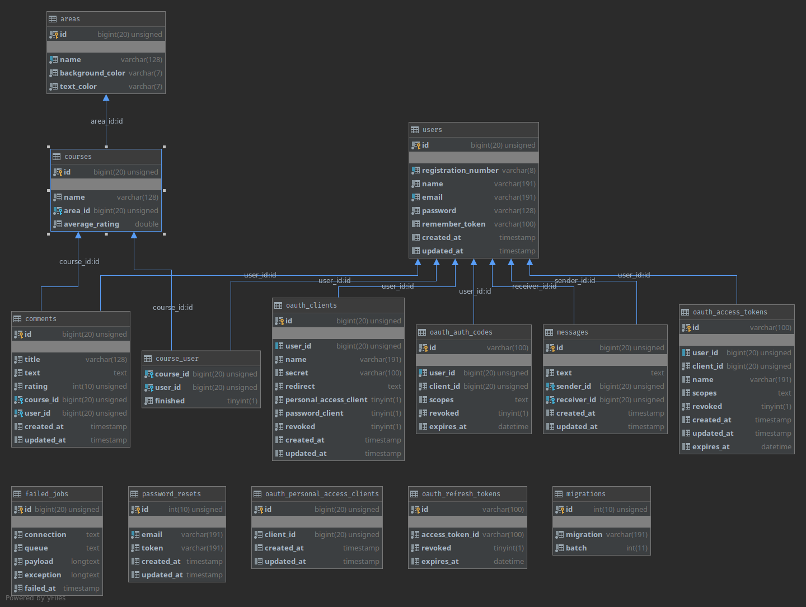

# Ratings UniGe

Sistema di raccoglimento delle opinioni degli studenti sui corsi dell'Università degli studi di Genova

## Database

Per la generazione del database abbiamo utilizzato il gestore di migrazioni di laravel.  
I campi sono stati popolati con il sistema di seeder di laravel in due modi diversi:  
- Le aree e i corsi sono state popolati a partire da un file JSON di cui abbiamo fatto il parsing con php e graie ad Eloquent lo abbiamo inserito sul DB.  
- Utenti (fatta eccezione per i nostri) e corsi sono stati generati in maniera casuale utilizzando il pacchetto `faker` di `fzaninotto` 

## Front-end
Per il front-end abbiamo deciso di utilizzare Vue, un framework per la creazione di componenti js (come React o angular).  
